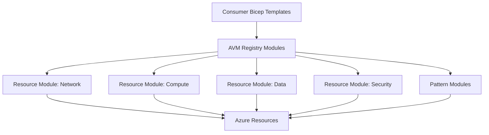

# Azure Verified Modules Implementation

## Project Overview
This project showcases my implementation and contributions to the Azure Verified Modules (AVM) initiative, demonstrating best practices in modular, reusable infrastructure code for Azure deployments.

## What are Azure Verified Modules?
Azure Verified Modules (AVM) represent Microsoft's initiative to establish a standard for high-quality, secure, and consistent infrastructure as code modules. These modules adhere to strict quality criteria and are designed for enterprise-grade deployments.

## My Contributions
I've actively contributed to the AVM community through:

1. **Module Development**
   - Created custom modules following AVM standards
   - Contributed improvements to existing modules
   - Implemented testing frameworks for module validation

2. **Implementation Examples**
   - Showcased real-world implementations using AVM patterns
   - Developed integration patterns between various modules
   - Created documentation and architecture guidance

## Key Features of AVM Implementation
- **Consistency**: Standardized module interfaces and outputs
- **Compliance**: Built-in policy controls and security baselines
- **Testing**: Comprehensive testing framework for validation
- **Documentation**: Detailed guidance and examples
- **CI/CD Integration**: Deployment pipelines and validation

## Architecture Approach


## Code Sample: Using AVM Modules

```bicep
// Reference to AVM modules using registry paths
module vnet 'br/public:avm/res/network/virtual-network:1.0.1' = {
  name: 'vnetDeployment'
  params: {
    name: 'hub-vnet'
    addressPrefixes: [
      '10.0.0.0/16'
    ]
    subnets: [
      {
        name: 'GatewaySubnet'
        addressPrefix: '10.0.0.0/24'
      }
      {
        name: 'AzureFirewallSubnet'
        addressPrefix: '10.0.1.0/24'
      }
      {
        name: 'ApplicationSubnet'
        addressPrefix: '10.0.2.0/24'
        networkSecurityGroupId: nsg.outputs.resourceId
      }
    ]
    location: location
    tags: tags
  }
}

// Network security group using AVM module
module nsg 'br/public:avm/res/network/network-security-group:1.0.0' = {
  name: 'nsgDeployment'
  params: {
    name: 'app-nsg'
    securityRules: [
      {
        name: 'AllowHttpsInbound'
        properties: {
          priority: 100
          access: 'Allow'
          direction: 'Inbound'
          protocol: 'Tcp'
          sourcePortRange: '*'
          destinationPortRange: '443'
          sourceAddressPrefix: '*'
          destinationAddressPrefix: '*'
        }
      }
    ]
    location: location
    tags: tags
  }
}
```

## Implementation Benefits
- **Quality**: Leveraging peer-reviewed, thoroughly tested modules
- **Efficiency**: Accelerating deployments through reusable components
- **Governance**: Standardized approach to resource configuration
- **Maintenance**: Simplified updates and patching process
- **Expertise**: Demonstrating advanced Bicep patterns and practices

## Future Directions
- Implement pattern modules for common enterprise scenarios
- Contribute to the AVM testing framework
- Develop custom modules for specialized industry requirements
- Create training materials for AVM adoption

## Related Resources
- [Azure Verified Modules Documentation](https://aka.ms/AVM)
- [My Technical Blog Series on AVMs](../docs/blog/index.md)
- [GitHub Repository with Examples](https://github.com/yourusername/avm-examples) 