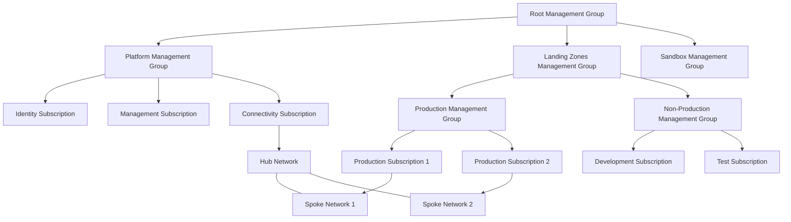

# Enterprise Landing Zone Implementation

## Project Overview
This project demonstrates a complete implementation of Microsoft's Enterprise-Scale Landing Zone architecture using Bicep templates. The solution provides a foundation for enterprise cloud adoption with governance, security, and compliance built-in.

## Key Features
- Management group hierarchy aligned to enterprise needs
- Subscription organization and governance
- Network topology with hub-and-spoke design
- Security controls and compliance policies
- Identity management integration
- Monitoring and logging solutions

## Architecture Diagram


## Implementation Approach
The implementation leverages Bicep modules from the [Azure Landing Zones Bicep](../projects/alz_bicep/) repository, customized to meet specific organizational requirements:

1. **Foundation Deployment**
   - Management Group Structure
   - Custom Policy Definitions
   - Role Assignments

2. **Network Implementation**
   - Hub-and-Spoke Design
   - Network Security Groups
   - Azure Firewall
   - VPN and ExpressRoute Connectivity

3. **Security Controls**
   - Centralized Logging
   - Security Center Integration
   - Just-in-time VM Access

4. **Governance Framework**
   - Policy Assignments
   - Compliance Reporting
   - Cost Management

## Code Sample: Management Group Creation

```bicep
module managementGroups 'modules/managementGroups/managementGroups.bicep' = {
  name: 'managementGroups'
  params: {
    managementGroups: [
      {
        name: 'platform'
        displayName: 'Platform'
        parentMgName: 'root'
      }
      {
        name: 'landingZones'
        displayName: 'Landing Zones'
        parentMgName: 'root'
      }
      {
        name: 'sandbox'
        displayName: 'Sandbox'
        parentMgName: 'root'
      }
    ]
  }
}
```

## Deployment Pipeline
The solution includes a CI/CD pipeline for automated deployments, enabling:
- Infrastructure validation
- Automated testing
- Controlled rollout
- Configuration drift detection

## Results and Benefits
- **Standardization**: Consistent environments across the enterprise
- **Security**: Pre-hardened infrastructure with defense-in-depth
- **Scalability**: Ready for growth without redesign
- **Efficiency**: Reduced deployment time from weeks to hours
- **Compliance**: Built-in regulatory compliance controls

## Technical Blog Series
For more details on this implementation, check out my [Azure Landing Zone Series](../docs/blog/alz/overview.md). 