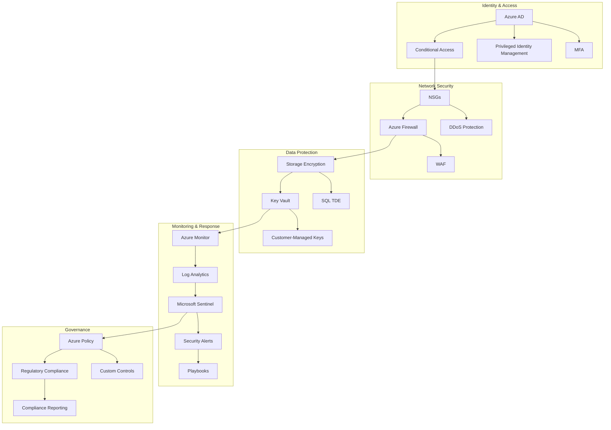

# Cloud Security Frameworks

## Project Overview
This project demonstrates the implementation of comprehensive security frameworks for Azure cloud environments, focusing on zero-trust architecture, automated compliance controls, and security baseline automation.

## Key Security Components

### Zero Trust Architecture
Implementing the principles that explicitly verify every access request, use least privilege access, and assume breach:

- **Identity Management**: Azure AD with Conditional Access and MFA
- **Device Security**: Microsoft Intune integration and compliance policies
- **Application Security**: Service Endpoints and Private Link configurations
- **Network Security**: Network segmentation and micro-segmentation
- **Data Protection**: Encryption in-transit and at-rest, Key Vault integration

### Compliance Automation
Automating regulatory compliance through infrastructure as code:

- **Compliance as Code**: Policy definitions for regulatory frameworks
- **Automated Auditing**: Continuous compliance assessment
- **Remediation Workflows**: Auto-remediation of compliance violations
- **Reporting Dashboards**: Executive-level compliance visibility

### Security Operations
Streamlining security management and response:

- **Unified Security Management**: Azure Security Center integration
- **SIEM Integration**: Log Analytics and Microsoft Sentinel
- **Threat Detection**: Advanced threat analytics and behavioral monitoring
- **Incident Response**: Automated security playbooks

## Architecture Diagram



## Implementation Approach

### Infrastructure as Code Security Patterns

The security framework is implemented entirely through infrastructure as code, using Bicep templates that codify security best practices:

```bicep
// Example: Implementing Storage Account Security with Bicep
module secureStorage 'modules/storage/storage-account.bicep' = {
  name: 'secureStorageDeployment'
  params: {
    name: 'stgcompliancedata${uniqueString(resourceGroup().id)}'
    sku: {
      name: 'Standard_GRS'
    }
    kind: 'StorageV2'
    minimumTlsVersion: 'TLS1_2'
    allowBlobPublicAccess: false
    networkAcls: {
      defaultAction: 'Deny'
      virtualNetworkRules: [
        {
          id: appSubnetId
          action: 'Allow'
        }
      ]
      ipRules: []
    }
    enableHns: true
    supportsHttpsTrafficOnly: true
    encryption: {
      services: {
        blob: {
          enabled: true
        }
        file: {
          enabled: true
        }
      }
      keySource: 'Microsoft.Storage'
    }
  }
}
```

### Security Baseline Automation

Automated deployment of security baselines across all Azure resources:

1. **Policy Assignment**: Dynamic assignment based on environment classification
2. **Baseline Templates**: Pre-configured security settings for each resource type
3. **Continuous Validation**: Automated testing of security controls
4. **Vulnerability Assessment**: Integrated scanning and remediation

### Compliance Reporting

Automated compliance reporting for various regulatory frameworks:

- NIST 800-53
- PCI DSS
- ISO 27001
- HIPAA
- Azure CIS Benchmarks

## Benefits and Outcomes

- **Risk Reduction**: Measurable reduction in security exposure
- **Operational Efficiency**: 85% reduction in manual security tasks
- **Compliance Adherence**: Continuous compliance with regulatory requirements
- **Incident Response**: 60% faster detection and remediation of security events
- **Scalability**: Security controls that scale with cloud adoption

## Related Resources

- [Zero Trust Implementation Guide](../docs/blog/security/zero_trust.md)
- [Compliance Automation Framework](../docs/blog/security/compliance_automation.md)
- [Security Baseline Catalog](../docs/blog/security/baseline_catalog.md) 