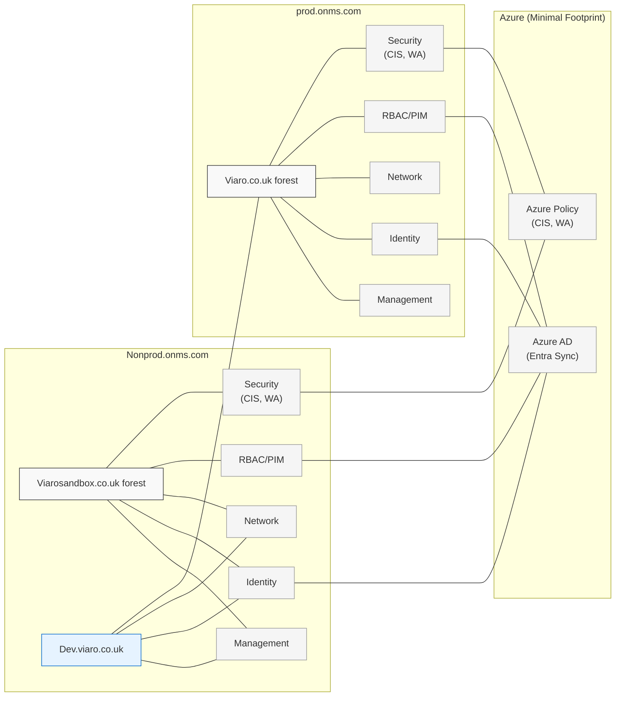

```mermaid
graph LR
    %% Define main containers for on-prem environments
    subgraph NonProd["Nonprod.onms.com"]
        Viarosandbox["Viarosandbox.co.uk forest"]
        Dev["Dev.viaro.co.uk"]
        M1["Management"]
        I1["Identity"]
        N1["Network"]
        RBAC1["RBAC/PIM"]
        Sec1["Security<br/>(CIS, WA)"]
    end
    
    subgraph Prod["prod.onms.com"]
        Viaro["Viaro.co.uk forest"]
        M2["Management"]
        I2["Identity"]
        N2["Network"]
        RBAC2["RBAC/PIM"]
        Sec2["Security<br/>(CIS, WA)"]
    end
    
    %% Minimal Azure integration
    subgraph Azure["Azure (Minimal Footprint)"]
        AAD["Azure AD<br/>(Entra Sync)"]
        Policy["Azure Policy<br/>(CIS, WA)"]
    end
    
    %% On-Prem Connections
    Viarosandbox --- M1
    Viarosandbox --- I1
    Viarosandbox --- N1
    Viarosandbox --- RBAC1
    Viarosandbox --- Sec1
    
    Dev --- M1
    Dev --- I1
    Dev --- N1
    
    Viaro --- M2
    Viaro --- I2
    Viaro --- N2
    Viaro --- RBAC2
    Viaro --- Sec2
    
    Dev --- Viaro
    
    %% Azure Connectivity: Identity and Governance bridge on-prem and cloud
    I1 --- AAD
    I2 --- AAD
    RBAC1 --- AAD
    RBAC2 --- AAD
    Sec1 --- Policy
    Sec2 --- Policy

    %% Styling
    classDef forest fill:#f9f9f9,stroke:#333,stroke-width:1px
    classDef domain fill:#e6f3ff,stroke:#0066cc,stroke-width:1px
    classDef group fill:#f5f5f5,stroke:#999,stroke-width:1px
    
    class Viarosandbox,Viaro forest
    class Dev domain
    class M1,M2,I1,I2,N1,N2,RBAC1,RBAC2,Sec1,Sec2,AAD,Policy group

```